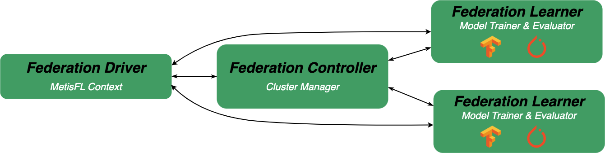

# MetisFL: The blazing-fast and developer-friendly federated learning framework.

&nbsp;
<div align="center">
 
</div>
&nbsp;

MetisFL is a federated learning framework that allows developers to federate their machine learning workflows and train their models across distributed datasets without having to collect the data in a centralized location. Currently, the project is transitioning from a private, experimental version to a public, beta phase. We are actively encouraging developers, researchers and data scientists to experiment with the framework and contribute to the codebase.


Homepage: https://nevron.ai/ \
Github: https://github.com/NevronAI \
Docs: https://docs.nevron.ai/ \
Slack: [https://nevronai.slack.com](https://join.slack.com/t/nevronai/shared_invite/zt-1xyc308jq-FeNBbuF1UBBwhp4H~zHCww)


MetisFL sprung up from the Information and Science Institute (ISI) in the University of Southern California (USC). It is backed by several years of Ph.D. and Post-Doctoral research and several publications in top-tier machine learning and system conferences. It is being developed with the following guiding principles in mind:

* **Scalability**: MetisFL is the only federated learning framework with the core controller infrastructure developed solely on C++. This allows for the system to scale and support up to 100K+ learners!

* **Speed**: The core operations at the controller as well as the controller-learner communication overhead has been optimized for efficiency. This allows MetisFL to achieve improvements of up to 1000x on the federation round time compared to other federated learning frameworks.

* **Efficiency and Flexibility**: MetisFL supports synchronous, semi-synchronous and asynchronous protocols. The different choices make our framework flexible enough to adapt to the needs of each use-case. Additionally, the support of fully asynchronous protocol makes MetisFL a highly efficient solution for use-cases with high heterogeneity on the compute/communication capabilities of the learners.

* **Strong Security**: MetisFL supports secure aggregations with fully homomorphic encryption using the [Palisade](https://gitlab.com/palisade/palisade-release) C++ cryptographic library.  This ensures that the weights of the produced models remain private and secure in transit.

# Quickstart (coming soon)
As an introductory example to quickly demonstrate the MetisFL framework in practice, we will run the `Hello World` example of deep learning. To get started, first install ensure that you system meets the requirements:

* Python 3.8 to 3.10
* A x86_64 Linux distro (tested on Ubuntu Focal)

Install the `metisfl` Python package by running:

```Bash
pip install metisfl
```

and then clone the repository on you local machine:

```Bash
git clone https://github.com/NevronAI/metisfl.git
```
Navigate on the root project folder and run:
```Bash
python examples/keras/fashionmnist.py
```
Congratulations! You are now running your first federated learning experiment using MetisFL!

# Development Environment
Developers interested in making core contributions should set up their environment accordingly.
There are currently 3 options for setting up your development environment:

## Codespaces Container

This is the fastest way for a developer to explore the codebase and make contributions.
Simply navigate to the main page of the repository, chose the branch which you want to work on,
click on the **Code** button and then on the **Codespaces** tab. Then pick the pre-configured container
and spin up the Codespace. We have pre-configured a container with the Python 3.10 as well as all the
dependencies installed. For the Codespaces container we include pre-compiled binaries for the C++ code.
This option is ideal for someone who wants to quickly experiment with the Python side of the framework.

## Local Container

This is the recommended way if you are planning on compiling the C++ code as it will allow you to do so without modifying or relying on your host system. Start by cloning the repository on your local machine and making sure that you have the [Dev Containers](https://code.visualstudio.com/docs/devcontainers/containers) VS Code extension installed. The extension will pick up the configuration from the `.devcontainer` folder and setup the container for you. If you use a different IDE, you can manually build the docker dev image using the Dockerfile in the `.devcontainer` folder.

## Host Machine
If you want to develop on your host machine, you need to ensure that it satisfies the requirement and that all needed packages are installed. Currently, the development environment mentioned bellow has been tested on Ubuntu OS and for the x86_64 architecture. It should, however, work for different Linux-like OS on the same architecture. Support for different architectures is under development. The requirements for compiling and testing the code on your local machine are:

* Bazel 4.2.1
* Python 3.8 - 3.10
* Python header and distutils
* build-essential, autoconf and libomp-dev

The recommended way to install Bazel is to use the [Bazelisk](https://github.com/bazelbuild/bazelisk) launcher and place the executable somewhere in your PATH, i.e., `/usr/bin/bazel` or `/usr/bin/bazelisk`. Please make sure that the name of the Bazelisk executable matches the BAZEL_CMD variable in `setup.py`. By default, the setup script will search for `bazelisk`. Bazelisk will automatically pick up the version from the `.bezelversion`file and then download and execute the corresponding Bazel executable.

The Python headers and distutils are needed so that the C++ controller and encryption code can be compiled as Python modules. On Ubuntu, they can be installed with the following command:

```Bash
apt-get -y install python3.10-dev python3.10-distutils
```

Finally, the remaining requirements contain the compiler, autoconf and libomp (which is used for parallelization). Please make sure that they are available in your system by running:

```Bash
apt-get -y install build-essential autoconf libomp-dev
```

# Build Project
Whether you are in your host machine or inside the container, you can build MetisFL from source by running the following command:
```Bash 
python setup.py 
```
The build target of this script is a Python Wheel which will be placed in the `build` folder. In the process of producing that build, several other targets will be built such as the controller binaries `metisfl/controller/controller.so`, the Palisade/encryption binaries `metisfl/encryption/fhe.so` and the Protobuf/gRPC Python classes in `metisfl/proto` directory.

# Project Structure Overview
The project uses a unified codebase for both the Python and C++ code. The C++ modules, i.e., `controller` and `encryption`, have simple python bindings to expose their functionality to python code. The python bindings of the encryption module are directly used by the Learner for encrypting the weight before sending them to the controller. Even though no module has a dependency on the python bindings of the controller, we do provide those bindings as well, as they provide a simple way to interact with the controller from pure Python code.

    .
    ├── docker                # Docker files for packaging MetisFL in a docker container       
    ├── examples              # Examples and use-cases for MetisF
    ├── metisfl               # Main source code folder
        ├── controller        # C++ implementation of the Controller/Aggregator
        ├── driver            # Python library for the MetisFL Driver
        ├── encryption        # C++ Palisade library
        ├── learner           # Python Learner library 
        ├── models            # Tensorflow & Pytorch backend support
        ├── proto             # Protobuf definitions for communication
        ├── resources         # FHE/SSL related resource files and keys
        ├── utils             # Utilities classes and functions      
    ├── test                  # Testing folder (under construction)
    ├── LICENSE               # License file
    ├── BUILD.bazel           # Bazel build file; contains main target definitions
    ├── setup.py              # Setup script; compiles and produces a Python Wheel
    ├── WORKSPACE             # Bazel workspace; contains external dependencies

# Architecture Overview
The architecture of MetisFL is inspired by Apache Spark. It consists of three main entities: the **Federation Controller**, the **Federation Learner** and the **Federation Driver**.



## Federation Controller
The Federation Controller acts as the federation cluster manager, and it is responsible for selecting and delegating training and evaluating tasks to the federation learners (cluster nodes) and storing and
aggregating the learners’ local models (w/ or w/out encryption).

## Federation Learner
The Federation Learner(s) are the cluster node responsible for training and evaluating the federation model assigned to the by the Controller on the local, private dataset.

## Federation Driver
The Federation Driver parses the federated learning workflow defined by the system user and creates the Metis Context. The Metis Context is responsible for initializing and monitoring the federation cluster, initializing the original federation model state, defining the data loading recipe for each learner, and generating the security keys where needed (e.g., SSL certificates, and FHE key pair).
