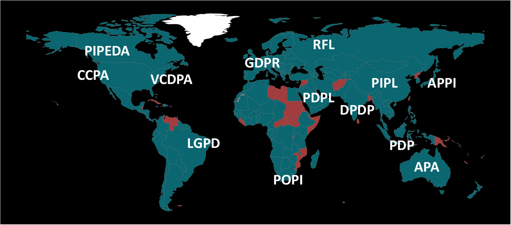

Data Privacy
=============================
Data useful for a machine learning problem is often generated at multiple, distributed locations. In many situations, these data cannot be exported from their original location due to regulatory, competitiveness, or privacy reasons. A prototypical example is electronic health records. These data types are heavily regulated and protected, limiting the ability of data sharing and performing meaningful data analysis. Similarly, other data types, like industrial data (e.g., accident or safety data), may not be possible to be shared with other business entities due to competitiveness reasons. 

## Data Regulations :balance_scale:
When also taking into account the more strict data regulatory frameworks that have been recently enacted across the world, such as the European Union's General Data Protection Regulation (GDPR), China's Personal Information Protection Law (PIPL), and the California Consumer Privacy Act (CCPA) it is clear that data sharing or transfer is almost prohibitive. These data regulatory frameworks (see also Figure [below](#data_privacy_regulations_img)) govern data accessing, processing and analysis procedures and provide transparency and protection for personal and proprietary data from illegal access and malicious use. As a result, new tools are required that will allow to perform meaningful large-scale data analysis while at the same time providing compliance with the introduced data privacy and security legislations.

 

> **Note:**  The plotted legislation data were gathered by the [United Nations Conference on Trade and Development](https://unctad.org/page/data-protection-and-privacy-legislation-worldwide). 
In total, 137 out of 194 countries worldwide have enacted or drafted data privacy laws.
 