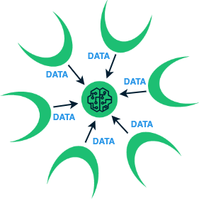
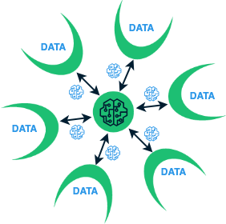

<!-- To get rid of tables borders -->

Federated Learning
=============================

One potential solution to enable for secure and private data analysis is Federated Learning [[mcmahan2017](#mcmahan2017), [kairouz2019](#kairouz2019), [yang2019](#yang2019)]. Federated Learning was introduced in the seminal work of McMahan et al. [[mcmahan2017](#mcmahan2017)] for user data in mobile phones and has recently emerged as a standard computational paradigm for distributed machine and deep learning across geographically distributed data sources. 

Throughout the federated training process the raw data always remain at the original source. This process contradicts the traditional machine learning algorithms that require all training data to be aggregated at a centralized location. Such a data aggregation step introduces huge security and privacy threats and violate regulations enforced by the data regulatory frameworks.

Federated Learning relaxes the need for raw data aggregation and pushes the training of the machine learning model down to each data source. During federated training, only the locally trained model parameters are shared with a centralized entity that is responsible for aggregating these parameters and compute the federated model. Figure~\ref{fig:RepresentativeLearningEnvironments} shows a representative centralized and federated learning environment and how both environments differ in regard to data (centralized) and model (federated) sharing.

| Centralized Machine Learning   |      Federated Machine Learning      |
|:----------:|:-------------:|
|  |   |

## Centralized vs. Federated Model Performance
Many recent studies have shown that Federated Machine Learning can achieve comparable performance as Centralized Machine Learning across many challenging learning tasks 

## Federated Learning Topologies

## References

<a name="mcmahan2017">[mcmahan2017]</a> McMahan, Brendan, Eider Moore, Daniel Ramage, Seth Hampson, and Blaise Aguera y Arcas. "Communication-efficient learning of deep networks from decentralized data." In Artificial intelligence and statistics, pp. 1273-1282. PMLR, 2017.

<a name="yang2019">[yang2019]</a> Yang, Qiang, Yang Liu, Tianjian Chen, and Yongxin Tong. "Federated machine learning: Concept and applications." ACM Transactions on Intelligent Systems and Technology (TIST) 10, no. 2 (2019): 1-19.

<a name="kairouz2019">[kairouz2019]</a> Kairouz, Peter, H. Brendan McMahan, Brendan Avent, Aurélien Bellet, Mehdi Bennis, Arjun Nitin Bhagoji, Kallista Bonawitz et al. "Advances and open problems in federated learning." Foundations and Trends® in Machine Learning 14, no. 1–2 (2021): 1-210.

