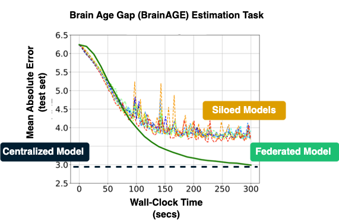
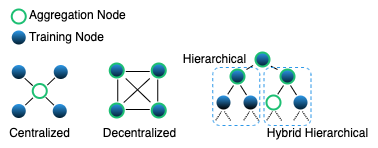

Federated Learning
=============================

One potential solution to enable for secure and private data analysis is Federated Learning [[mcmahan2017](#mcmahan2017), [kairouz2019](#kairouz2019), [yang2019](#yang2019)]. Federated Learning was introduced in the seminal work of McMahan et al. [[mcmahan2017](#mcmahan2017)] for user data in mobile phones and has recently emerged as a standard computational paradigm for distributed machine and deep learning across geographically distributed data sources. 

Throughout the federated training process the raw data always remain at the original source. This process contradicts the traditional machine learning algorithms that require all training data to be aggregated at a centralized location. Such a data aggregation step introduces huge security and privacy threats and violate regulations enforced by the data regulatory frameworks.

Federated Learning relaxes the need for raw data aggregation and pushes the training of the machine learning model down to each data source. During federated training, only the locally trained model parameters are shared with a centralized entity that is responsible for aggregating these parameters and compute the federated model. The figures below show a representative centralized and federated learning environment and how both environments differ with respect to data (centralized) and model (federated) sharing.

| Centralized Machine Learning   |      Federated Machine Learning      |
|:----------:|:-------------:|
|  |   |

## Centralized vs. Siloed vs. Federated Models Performance
A couple of studies (see also [[mcmahan2017](#mcmahan2017), [kairouz2019](#kairouz2019), [rieke2020](#yang2020)]) have shown that Federated Machine Learning models can achieve comparable performance as centralized models across various challenging learning tasks. 

Here, we discuss a prototypical use case where the learning task is to predict the chronological brain age from brain structural MRI scans. The difference between the predicted and true chronological brain age values is a phenotype related to aging and brain disease. This learning task is commonly referred to as BrainAGE. 

To demonstrate the significance and promise of Federated Learning, in the figure below, we compare the performance of a federated CNN model trained (using MetisFL) across 8 data sources/silos to its centralized and siloed counterparts. By centralized, we refer to the model trained over all pooled data and by siloed to the model trained at each source indepedently. For more details and more thorough evaluation please refer to [[stripelis2022](#stripelis2022)].

 

> **Note:** For this illustrative case the data distribution for the federated environment is IID, the federated training was conducted over 40 federation rounds and the local optimizer used is Vanilla SGD.

## Federated Learning Topologies
The physical location, the computational capabilities and the data disribution of learners (nodes, clients) participating in the training of a federated model can greatly affect the communication architecture and workflow of a federated learning environment. Depending on the requirements that the federated training workflow needs to satisfy different topologies can be constructed:

* The **centralized** (star-shaped) topology is the most widely used and consists of a centralized controller (coordinator, aggregator) and a collection of learners. The controller orchestrates the execution of the federated learning workflow and it is responsible to periodically aggregate the locally trained models of the participating learners. 

* In the case where a centralized controller is absent, then learners can communicate directly to each other and aggregate other learners' local models. This federated learning topology is known as **decentralized** or **peer-to-peer**.

* When multiple controllers/coordinators and a set of cloud-networks and/or sub-aggregators are combined in a more hierarchical-like structure, then we can identify the **hierarchical** (head aggregator with sub-aggregators) or the **hybrid hierchical** (different combinations of aggregation and training nodes) federated learning topologies. 

The figure below visualized the differences across the centralized, decentralized and hierarchical topologies; the figure follows the design approaches proposed by [[rieke2020]](#rieke2020).

 

> **Note:** The centralzed topology is most of the time seen in federated environments where participating learners are large organizations/institutions, a.k.a. cross-silo federated settings. However, this topology is also applicable to federated environments consisting of edge devices, a.k.a cross-device federated settings. In the case of decentralized and hierarchical topologies, these are more applicable to cross-device settings.

## References

<a name="mcmahan2017">[mcmahan2017]</a> McMahan, Brendan, Eider Moore, Daniel Ramage, Seth Hampson, and Blaise Aguera y Arcas. "Communication-efficient learning of deep networks from decentralized data." In Artificial intelligence and statistics, pp. 1273-1282. PMLR, 2017.

<a name="yang2019">[yang2019]</a> Yang, Qiang, Yang Liu, Tianjian Chen, and Yongxin Tong. "Federated machine learning: Concept and applications." ACM Transactions on Intelligent Systems and Technology (TIST) 10, no. 2 (2019): 1-19.

<a name="kairouz2019">[kairouz2019]</a> Kairouz, Peter, H. Brendan McMahan, Brendan Avent, Aurélien Bellet, Mehdi Bennis, Arjun Nitin Bhagoji, Kallista Bonawitz et al. "Advances and open problems in federated learning." Foundations and Trends® in Machine Learning 14, no. 1–2 (2021): 1-210.

<a name="rieke2020">[rieke2020]</a> Rieke, Nicola, Jonny Hancox, Wenqi Li, Fausto Milletari, Holger R. Roth, Shadi Albarqouni, Spyridon Bakas et al. "The future of digital health with federated learning." NPJ digital medicine 3, no. 1 (2020): 119.

<a name="stripelis2022">[stripelis2022]</a> Stripelis, Dimitris, Paul M. Thompson, and José Luis Ambite. "Semi-synchronous federated learning for energy-efficient training and accelerated convergence in cross-silo settings." ACM Transactions on Intelligent Systems and Technology (TIST) 13, no. 5 (2022): 1-29.