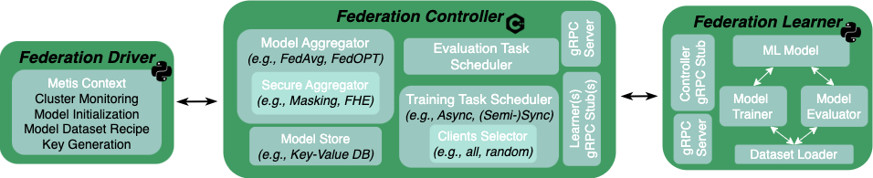

Components
=============================

 

<!-- This is a high-level overview of how federated training is performed and when and how the synchronization points between
the learners and the controller are created.

**1. Controller Training Assignment**\
The controller creates and assigns the task that each learner needs to run by sending to every learner (the state of)
the community model and any other learning parameters, such as the number of local updates, the learning hyperparameters
and any other necessary training information. Subsequently, the controller pings each learner though the respective gRPC
endpoint (see `RunTask` gRPC endpoint in `learner.proto`). 

**2. Learner Local Training** \
Upon receiving the training task, the learner starts training locally on its local dataset and once it completes its
training, it sends its local model along with any associated training metadata to the controller. At this point, the 
learner pings the controller and sends a local training completion request (see `MarkTaskCompleted` gRPC endpoint in `controller.proto`).

**3. Synchronization Points (a.k.a. Federation Round)** \
The controller receives the local models and if a quorum exists (e.g., received local models from all learners), then it
computes the new community model using the local models and their associated scaling factors
(e.g., number of training examples) and creates and reassigns the new training task to each learner. At this point a new
global training iteration begins.  -->
