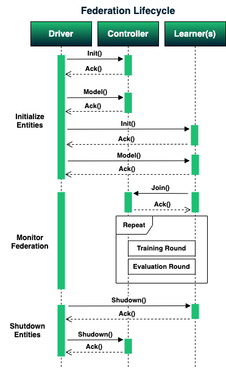
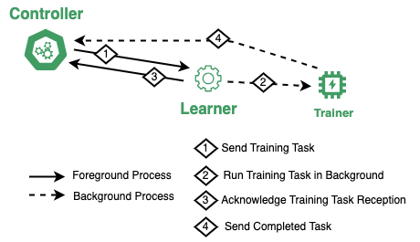
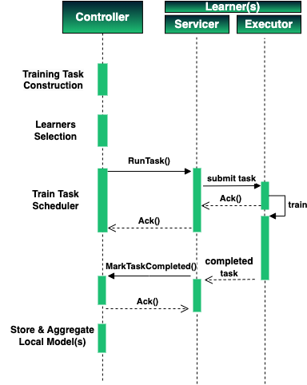
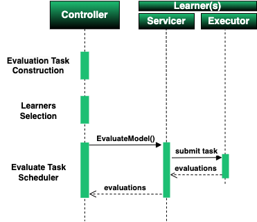

# Procedures

Here, we present the internal mechanisms of MetisFL with repsect to federation initialization, and federated model traninig and evaluation using a synchronous scheduler.

## Federation Lifecycle

The Federation lifecycle consists of three core steps: _initialization, monitoring, shutdown_:

The driver first **initializes** the controller process at the remote host (or localhost) and receives an acknowledgment when the remote process is alive. Thereafter, the driver sends the initial state of the model (just the model tensors not the actual architecture) to the controller and proceeds with learners' initialization. Once all learners are initialized, the driver sends the model (model tensors & architecture) to every other learner.

> **Note:** The learners need the actual model architecture since learners are required to perform training and evaluation on their local private datasets, whereas the controller is responsible to merely orchestrate the federation workflow and aggregate learners' models.

The learners then register with the controller (join federation) and the training and the evaluation of the federated model takes place for multiple federation rounds. Note that, at every federation round the global model is sent for training and subsequently for evaluation to the participating learners. At this point, the driver **monitors** the lifecycle of the federation and periodically pings remote processes for their status. If any of the federated training termination criteria are met, such as the execution wall-clock time or number of federation rounds, then the driver sends a **shutdown** signal to all processes (learners first, controller second).

 

 

## Training Round

Before the training federation round starts, the controller creates/defines the model training task and selects the learners who will participate in model training. Once the learners have been selected the train task scheduler sends the training task to every participating learner (RunTask request).

The Learner receives the task through the Learner Servicer process and submits the training task to the training task pool executor running in the background. Upon task submission, the executor replies an Acknowledgement message that the servicer relays back to the controller.

> **Note:** The status of the acknowledgement is false when the training task is not submitted, received or any unexpected failure occurs.

The submitted training task is registered with a callback function that will handle the completed training task when it is completed When this occurs, the servicer sends a MarkTaskCompleted request to the controller containing the learner's local model and any other execution metadata related to model training. Finally, the controller stores and aggregates all received local models.

> **Clarification:** The training tasks are asynchronous calls, meaning that the controller does not wait for the training task to complete. The controller simply submits the task but the learner needs to inform the controller when its local training is complete.

|                                 Training Round Overview                                 |                         Training Round with Requests                         |
| :-------------------------------------------------------------------------------------: | :--------------------------------------------------------------------------: |
|  |  |

 

## Evaluation Round

Similar to the training round, the evaluation round starts with the controller constructing the evaluation task and selecting the learners that will participate in the evaluation of the global model. Once these steps are defined, the evaluation task scheduler sends an EvaluateModel request to all participating learners and receives the respective model evaluations.

> **Clarification:** The evaluation tasks are synchronous calls, meaning that the controller keeps the connection alive till the evaluation of the model is complete.

 

