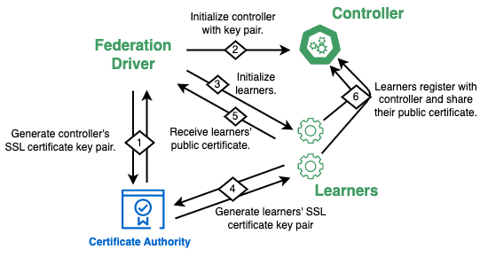

SSL-Enabled Federated Training (Simulated Environment)
=============================
In this guide, we describe how to enable secure SSL-enabled connection
between the federation driver, controller and learners model
in a simulated (not production) federated learning environment. In particular:

- We give some background information on certificates.
- How SSL connectivity is performed within MetisFL.
- How to use default and/or generate new (self-signed) certificates.
- How to enable SSL to run federated experiments in MetisFL.


Certificates Background
------------
When establishing SSL-enabled connections we need first to generate the
pair of files (private_key, public_certificate) that will be used by the
server process running at a given host (e.g., learner/controller). This
will allow the server to receive secure connections from requesting clients.

From the perspective of SSL connectivity, in a federated learning setting
every participating entity (controller, learners) acts both as a client
and as a server at different points of the federated execution workflow.

When the controller receives model update requests from the learners, the
controller acts as a server and the learners as the server's clients. Similarly,
when a learner receives local model training requests from the controller, the
learner acts as a server and the controller as a client.


MetisFL SSL Connectivity Design
------------
In a MetisFL simulated environment, the internal mechanism for enabling
SSL connectivity starts with the federation driver. The driver uses the
defined SSL certificates (either sel-signed or trusted authority) to start
the federation controller and spawn its server process with the provided
key pair. Analogously, the driver initializes the learner processes using the
defined pair. Finally, during the learner-controller registration, the learners
share their public certificate with the controller as part of the exchanged message.

The figure below shows the SSL connectivity execution flow:

<div align="center">
 
</div>

> **Note:** In a production environment, it is not required for the SSL certificates 
to be generated by the driver. The certificates can be generated independently by each process
(controller, learner) and then the public certificates can be shared with the driver 
to establish secure connections wherever is needed.


Default & Self-Signed Certificates
------------
By default, MetisFL is shipped with pre-generated self-signed certificates. 
These certificates can be found in the following directory: [`resources/ssl_config/default`](../resources/ssl_config/default)

If a user wants to generate a new pair of self-signed certificates for development purposes
the [`resources/ssl_config/gen_certificates.sh`](../resources/ssl_config/gen_certificates.sh) script is provided for convenience.


Running Simulated MetisFL with SSL
------------
To demonstrate how SSL is enabled between a single learner and a controller we will describe
the SSL specific values of the following template file:
[examples/federation_environments_config/template_with_ssl.yaml](../examples/federation_environments_config/template_with_ssl.yaml)

By default, the SSL functionality is disabled. For any federated experiment we want to run using SSL,
first we need to add the key-value pair `EnableSSL: True` within the `CommunicationProtocol` type
in the templated yaml file of the experiment.

Thereafter, there are two scenarios:

- Scenario-1: No public certificate and private key is defined. The experiment will use the default pair
under `resources/ssl_config/default`. The public certificate and the private keys will be shared
as bytes (stream) from the driver to the controller and from the driver to the learners.

- Scenario-2: If we do not want to use the default pair of (private key, certificate) we have to define
a new key pair in the experiment's templated yaml file for every entity (controller, learner), such as:

```
    SSLConfigs:
      PrivateKey: <path to private key>
      PublicCertificate: <path to public certificate>
```
If SSL is enabled but the SSL configs are not defined for an entity, then MetisFL will use the default
pair of keys for that entity (i.e., falls back to Scenario-1)

Additional Resources
--------------------
The source below can help get a deeper understanding of SSL certificates:

- OpenSSL Certificate Authority: https://jamielinux.com/docs/openssl-certificate-authority/index.html
