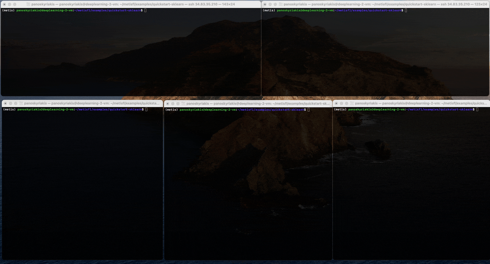

# 🚀 MetisFL Quickstart: SKLearn

<div align="center">
<picture>
  
</picture>
</div>

&nbsp;

This example shows how to use MetisFL to a simple SKLearn logistic regression model on the MNIST dataset. The example is based on the official SKLearn [tutorial](https://scikit-learn.org/stable/auto_examples/linear_model/plot_sparse_logistic_regression_mnist.html). The guide describes the main steps and the full scripts can be found in the [examples/quickstart-sklearn](https://github.com/NevronAI/metisfl/tree/main/examples/quickstart-sklearn) directory. 

## ⚙️ Prerequisites

Before running this example, please make sure you have installed the MetisFL package 

```bash
pip install metisfl
```

Additionally, make sure to install the sklearn package

```bash
pip install scikit-learn
```

## 💾 Dataset

The dataset used in this example is the classical [MNIST](https://www.kaggle.com/datasets/hojjatk/mnist-dataset) dataset which can be downloaded using the `fetch_openml` function of the `sklearn.datasets` package. To prepare the dataset for simulated federated learning, we need to split it into chunks and distribute them to clients. We can use the `iid_partition` function in `metisfl.common.utils` package to do this. 

```python
def load_data(num_clients: int = 3) -> Tuple:
    x_train, y_train = fetch_openml(
        "mnist_784", version=1, return_X_y=True, as_frame=False, parser="pandas"
    )

    X_train, X_test, y_train, y_test = train_test_split(
        x_train, y_train, train_size=5000, test_size=10000
    )
    scaler = StandardScaler()
    X_train = scaler.fit_transform(X_train)
    X_test = scaler.transform(X_test)
    x_chunks, y_chunks = iid_partition(
        x_train=X_train, y_train=y_train, num_partitions=num_clients)

    return x_chunks, y_chunks, X_test, y_test
```

This function takes the dataset and splits it into `num_partitions` chunks. The optional `seed` parameter is used to control the randomness of the split and can be used to reproduce the same split. Both this random seed as well as the `iid_partitions` are kept constant in this example since the data loader function is part of the `learner.py` file which is used to start all the learners, as we will see later.

## 🧠 Model 

The model used in this example is a simple logistic regression model. 

```python
model = LogisticRegression(
    penalty="l2",
    max_iter=5,
    warm_start=True,
)

# Initialize the model
n_classes = 10
n_features = 784
model.coef_ = np.zeros((n_classes, n_features))
model.classes_ = np.arange(n_classes)
if model.fit_intercept:
    model.intercept_ = np.zeros(n_classes)
```

Note that the parameters are manually initialized to zero. This is needed because they are not defined before the first call to the `fit` method. However, the driver will need to request the parameters from a randomly selected learner to initialize the model on the controller side. 


## 👨‍💻 MetisFL Learner

The MetisFL Learner trains the model on the local dataset and communicates model updates with the server. The  class that defines the Learner can be found [here](https://github.com/NevronAI/metisfl/blob/main/metisfl/learner/learner.py). For this quickstart example, the Learner that we are using is the following: 

```python
class TFLearner(Learner):

    """A simple sklearn Logistic Regression learner."""

    def __init__(self, x_train, y_train, x_test, y_test):
        super().__init__()
        self.x_train = x_train
        self.y_train = y_train
        self.x_test = x_test
        self.y_test = y_test

    def get_weights(self):
        if model.fit_intercept:
            return [
                model.coef_,
                model.intercept_,
            ]
        return [model.coef_]

    def set_weights(self, parameters):
        model.coef_ = parameters[0]
        if model.fit_intercept:
            model.intercept_ = parameters[1]

    def train(self, parameters, config):
        self.set_weights(parameters)
        with warnings.catch_warnings():
            warnings.simplefilter("ignore")
            clf = model.fit(
                self.x_train,
                self.y_train,
            )
            score = clf.score(self.x_test, self.y_test)
            loss = log_loss(self.y_test, clf.predict_proba(self.x_test))
        return self.get_weights(), {"accuracy": score, "loss": loss}, {"num_train_examples": len(self.x_train)}

    def evaluate(self, parameters, config):
        self.set_weights(parameters)
        loss = log_loss(self.y_test, model.predict_proba(self.x_test))
        score = model.score(self.x_test, self.y_test)
        return {"accuracy": score, "loss": loss}
```

The `get_model()` function is in the aforementioned `model.py` and returns the previously described simple 2-layer Dense Neural Network. The `get_weights()` and `set_weights()` functions are used to get and set the model parameters. The `train()` function is used to train the model on the local dataset. The `evaluate()` function is used to evaluate the model on the local test dataset. The `train` and `evaluate` functions use the model weights sent by the controller to train on the local dataset. They can optionally use any of the configuration parameters sent by the controller in the `config` dictionary. 

## 🎛️ MetisFL Controller

The Controller is responsible send training and evaluation tasks to the learners and for aggregating the model parameters. The entrypoint for the Controller is `Controller` class found [here](https://github.com/NevronAI/metisfl/blob/127ad7147133d25188fc07018f2d031d6ad1b622/metisfl/controller/controller_instance.py#L10).

```python 
controller_params = ServerParams(
    hostname="localhost",
    port=50051,
)

controller_config = ControllerConfig(
    aggregation_rule="FedAvg",
    communication_protocol="Synchronous",
    scaling_factor="NumTrainingExamples",
)

model_store_config = ModelStoreConfig(
    model_store="InMemory",
    lineage_length=0
)

controller = Controller(
    server_params=controller_params,
    controller_config=controller_config,
    model_store_config=model_store_config,
)
```

The ServerParams define the hostname and port of the Controller and the paths to the root certificate, server certificate and private key. Certificates are optional and if not given then SSL is not active. The ControllerConfig defines the aggregation rule, communication protocol and model scaling factor. For the full set of options in the ControllerConfig please have a look [here](https://github.com/NevronAI/metisfl/blob/127ad7147133d25188fc07018f2d031d6ad1b622/metisfl/common/types.py#L99). Note that the "NumTrainingExamples" scaling factor requires that the Learner instance provides the size of its training dataset at initialization. Finally, this example uses an "InMemory" model store with no eviction (`lineage_length=0`). 


## 🚦 MetisFL Driver

The MetisFL Driver is the main entry point to the MetisFL framework. It is responsible for coordinating the communication between the clients and the server, for initializing the weights of the shared model, monitoring the federated training and shutting down the system when the training is done. The Driver is initialized as follows:

```python
def get_learner_server_params(learner_index, max_learners=3):    
    ports = list(range(50002, 50002 + max_learners))

    return ServerParams(
        hostname="localhost",
        port=ports[learner_index],
    )

termination_signals = TerminationSingals(federation_rounds=5)
learners = [get_learner_server_params(i) for i in range(max_learners)]

session = DriverSession(
    controller=controller_params,
    learners=learners,
    termination_signals=termination_signals,
)
logs = session.run()
```
The TerminationSignals control when the federated training is stopped. For this example, we will stop the training when we reach 5 federation rounds. For other possible termination signals, please have a look at the class definition and the docstring here [here](https://github.com/NevronAI/metisfl/blob/127ad7147133d25188fc07018f2d031d6ad1b622/metisfl/common/types.py#L18).

## 🎬 Running the example

To run the example, you need to open one terminal for the Controller, one terminal for each Learner and one terminal for the Driver. First, start the Controller. 

```bash
python controller.py
```
Then, start the Learners.

```bash
python learner.py --learner ID
```

where `ID` is the numerical id of the Learner (1,2,3). Please make sure to start the controller before the Learners otherwise the Learners will not be able to connect to the Controller. Finally, start the Driver. 

```bash
python driver.py
```
The driver will run the federated training for 5 rounds and then stop. The training logs will be save in the `results.json` file in the current directory.

## 🚀 Next steps
